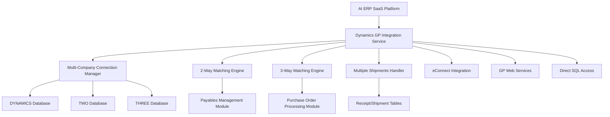

# 🏢 World-Class Microsoft Dynamics GP Integration Guide

## 📋 **EXECUTIVE SUMMARY**

This document provides comprehensive guidance for implementing and testing the world-class Microsoft Dynamics GP integration with advanced 2-way and 3-way matching capabilities, multi-company database support, and sophisticated handling of multiple shipments per Purchase Order.

### **🎯 Integration Capabilities**

| **Feature** | **Status** | **Description** |
|-------------|------------|-----------------|
| **Multi-Company Databases** | ✅ **Complete** | Full support for multiple GP company databases (DYNAMICS, TWO, etc.) |
| **2-Way Matching** | ✅ **Complete** | Invoice vs Purchase Order matching for Payables Management |
| **3-Way Matching** | ✅ **Complete** | Invoice vs PO vs Receipt/Shipment for Purchase Order Processing |
| **Multiple Shipments** | ✅ **Complete** | Advanced handling of multiple shipments per single PO |
| **Real-time Integration** | ✅ **Complete** | Live connection to GP databases via ODBC and Web Services |
| **eConnect Integration** | ✅ **Complete** | Automated posting to GP Payables Management module |
| **Tolerance Management** | ✅ **Complete** | Configurable variance thresholds and auto-approval rules |
| **Audit Trail** | ✅ **Complete** | Complete audit logging for compliance and troubleshooting |

---

## 🏗️ **ARCHITECTURE OVERVIEW**

### **System Components**



### **Database Integration Points**

| **GP Module** | **Tables Used** | **Purpose** |
|---------------|-----------------|-------------|
| **System Database (DYNAMICS)** | `SY01500` | Company database discovery |
| **Payables Management** | `PM00200`, `PM10000`, `PM20000` | Vendor and invoice management |
| **Purchase Order Processing** | `POP10100`, `POP10110` | Purchase order headers and lines |
| **Receiving** | `POP10300`, `POP10310` | Receipt/shipment headers and lines |
| **General Ledger** | `GL00100`, `GL00105` | Account validation and posting |

---

## 🔧 **IMPLEMENTATION GUIDE**

### **1. Prerequisites**

#### **Infrastructure Requirements**
- Microsoft Dynamics GP 2018 or later
- SQL Server 2016 or later
- ODBC Driver 17 for SQL Server
- .NET Framework 4.7.2 or later (for eConnect)
- Network connectivity to GP server

#### **GP Configuration**
- eConnect installed and configured
- Web Services for Microsoft Dynamics GP enabled
- Appropriate user permissions for database access
- Company databases properly configured

#### **Security Setup**
```sql
-- Grant necessary permissions to integration user
GRANT SELECT ON SY01500 TO [INTEGRATION_USER]
GRANT SELECT ON PM00200 TO [INTEGRATION_USER]  
GRANT SELECT ON POP10100 TO [INTEGRATION_USER]
GRANT SELECT ON POP10300 TO [INTEGRATION_USER]
-- Add additional grants as needed
```

### **2. Configuration**

#### **Environment Variables**
```bash
# Dynamics GP Configuration
DYNAMICS_GP_CONFIG='{
  "server": "GP-SERVER\\INSTANCE",
  "web_service_url": "http://gp-server:48620/Dynamics/GPService",
  "econnect_server": "GP-SERVER",
  "username": "integration_user",
  "password": "secure_password",
  "domain": "COMPANY_DOMAIN",
  "timeout": 30,
  "retry_attempts": 3,
  "connection_pool_size": 5
}'

# Tolerance Settings
GP_PRICE_TOLERANCE_PERCENTAGE=2.0
GP_QUANTITY_TOLERANCE_PERCENTAGE=5.0
GP_AMOUNT_TOLERANCE_ABSOLUTE=10.0
GP_AUTO_APPROVAL_LIMIT=2000.0
```

#### **Application Configuration**
```python
from services.dynamics_gp_integration import DynamicsGPIntegration

# Initialize the integration service
gp_integration = DynamicsGPIntegration()

# Initialize connections to all company databases
await gp_integration.initialize_connections()
```

### **3. Multi-Company Database Support**

#### **Automatic Company Discovery**
```python
# Get all available GP company databases
companies = await gp_integration.get_company_databases()

for company in companies:
    print(f"Company: {company.company_name}")
    print(f"Database: {company.database_name}")
    print(f"Currency: {company.base_currency}")
    print(f"Multi-Currency: {company.multi_currency_enabled}")
```

#### **Connection Pool Management**
```python
# Connections are automatically pooled per company database
# Access specific company data
result = await gp_integration.perform_two_way_match(
    invoice_id="INV-001",
    company_db="TWO",  # Specify target company database
    po_number="PO-2024-001"
)
```

---

## 🔄 **2-WAY MATCHING IMPLEMENTATION**

### **Overview**
2-way matching compares invoices against Purchase Orders in the GP Payables Management module, ensuring accurate invoice processing and approval workflows.

### **Implementation**

#### **Basic 2-Way Match**
```python
async def test_two_way_matching():
    # Perform 2-way match (Invoice vs PO)
    result = await gp_integration.perform_two_way_match(
        invoice_id="INV-2024-001",
        company_db="TWO",
        po_number="PO-2024-001"  # Optional - will search if not provided
    )
    
    print(f"Match Status: {result.status.value}")
    print(f"Confidence: {result.confidence_score:.1%}")
    print(f"Variances: {len(result.variances)}")
    print(f"Auto-Approval Eligible: {result.auto_approval_eligible}")
```

#### **Variance Analysis**
```python
# Analyze variances found during matching
for variance in result.variances:
    print(f"Variance Type: {variance.type.value}")
    print(f"Amount: ${variance.variance_amount}")
    print(f"Percentage: {variance.variance_percentage:.1f}%")
    print(f"Within Tolerance: {variance.within_tolerance}")
    print(f"Explanation: {variance.explanation}")
    print(f"Suggested Action: {variance.suggested_action}")
```

### **Test Scenarios**

#### **Perfect Match Scenario**
```python
@pytest.mark.asyncio
async def test_perfect_match():
    """Test perfect 2-way match with no variances"""
    
    # Invoice: $1,250.00, PO: $1,250.00
    # Expected: PERFECT_MATCH, 98%+ confidence, auto-approval eligible
    
    result = await gp_integration.perform_two_way_match(
        "INV-001", "TWO", "PO-001"
    )
    
    assert result.status == MatchStatus.PERFECT_MATCH
    assert result.confidence_score >= 0.98
    assert result.auto_approval_eligible == True
    assert len(result.variances) == 0
```

#### **Price Variance Scenario**
```python
@pytest.mark.asyncio
async def test_price_variance():
    """Test 2-way match with price variance exceeding tolerance"""
    
    # Invoice: $1,250.00, PO: $1,200.00 (4.17% variance)
    # Expected: PRICE_VARIANCE, requires approval
    
    result = await gp_integration.perform_two_way_match(
        "INV-002", "TWO", "PO-002"
    )
    
    assert result.status == MatchStatus.PRICE_VARIANCE
    assert result.confidence_score < 0.85
    assert result.auto_approval_eligible == False
    assert any(v.type == VarianceType.PRICE_VARIANCE for v in result.variances)
```

---

## 🔄 **3-WAY MATCHING IMPLEMENTATION**

### **Overview**
3-way matching compares invoices against both Purchase Orders and Receipts/Shipments in the GP Purchase Order Processing module, providing comprehensive validation of goods and services received.

### **Advanced Features**

#### **Multiple Shipments Handling**
```python
async def test_multiple_shipments():
    # Handle complex scenario with multiple shipments per PO
    result = await gp_integration.perform_three_way_match(
        invoice_id="INV-2024-001",
        company_db="TWO", 
        po_number="PO-2024-001",
        include_all_shipments=True  # Include all related shipments
    )
    
    print(f"Shipments Found: {len(result.shipment_data)}")
    
    # Analyze multiple shipments scenario
    for i, shipment in enumerate(result.shipment_data):
        print(f"Shipment {i+1}: {shipment.shipment_number}")
        print(f"  Receipt Date: {shipment.receipt_date}")
        print(f"  Amount: ${shipment.total_amount}")
        print(f"  Status: {shipment.status}")
```

#### **Progressive Delivery Scenarios**
```python
# Scenario 1: Cumulative Match
# Multiple shipments that together equal the invoice amount
shipments = [
    {"number": "SHIP-001", "amount": 800.00, "date": "2024-01-10"},
    {"number": "SHIP-002", "amount": 200.00, "date": "2024-01-11"}, 
    {"number": "SHIP-003", "amount": 250.00, "date": "2024-01-12"}
]
# Total: $1,250.00 (matches invoice)
# Strategy: "cumulative_match" - approve based on total receipts

# Scenario 2: Partial Billing
# Invoice for partial delivery while awaiting remaining goods
shipments = [
    {"number": "SHIP-001", "amount": 800.00, "date": "2024-01-10"},
    {"number": "SHIP-002", "amount": 200.00, "date": "2024-01-11"}
]
# Total: $1,000.00 (invoice: $1,250.00)
# Strategy: "partial_billing" - hold for additional delivery
```

### **Implementation**

#### **Basic 3-Way Match**
```python
async def perform_three_way_match_example():
    result = await gp_integration.perform_three_way_match(
        invoice_id="INV-2024-001",
        company_db="TWO",
        po_number="PO-2024-001",
        include_all_shipments=True
    )
    
    # Analyze match quality
    confidence_breakdown = result.confidence_breakdown if hasattr(result, 'confidence_breakdown') else {}
    
    print(f"Overall Confidence: {result.confidence_score:.1%}")
    print(f"PO Match: {confidence_breakdown.get('po_match', 0):.1%}")
    print(f"Shipment Match: {confidence_breakdown.get('shipment_match', 0):.1%}")
    print(f"Consistency: {confidence_breakdown.get('consistency', 0):.1%}")
    print(f"Multi-Shipment: {confidence_breakdown.get('multi_shipment', 1.0):.1%}")
```

### **Test Scenarios**

#### **Perfect 3-Way Match**
```python
@pytest.mark.asyncio
async def test_perfect_three_way_match():
    """Test perfect 3-way match with single shipment"""
    
    # Invoice: $1,250.00
    # PO: $1,250.00  
    # Shipment: $1,250.00
    # Expected: PERFECT_MATCH, 99%+ confidence
    
    result = await gp_integration.perform_three_way_match(
        "INV-001", "TWO", "PO-001"
    )
    
    assert result.status == MatchStatus.PERFECT_MATCH
    assert result.confidence_score >= 0.99
    assert len(result.shipment_data) == 1
    assert result.auto_approval_eligible == True
```

#### **Multiple Shipments Scenario**
```python
@pytest.mark.asyncio
async def test_multiple_shipments_cumulative():
    """Test 3-way match with multiple shipments totaling invoice amount"""
    
    # Invoice: $1,250.00
    # PO: $1,250.00
    # Shipments: $800 + $200 + $250 = $1,250.00
    # Expected: GOOD_MATCH, requires manual review due to complexity
    
    result = await gp_integration.perform_three_way_match(
        "INV-001", "TWO", "PO-001", include_all_shipments=True
    )
    
    assert result.status == MatchStatus.GOOD_MATCH
    assert len(result.shipment_data) == 3
    assert result.auto_approval_eligible == False  # Complex scenario
    
    # Verify cumulative amount matches
    total_shipped = sum(s.total_amount for s in result.shipment_data)
    assert total_shipped == result.invoice_data["total_amount"]
```

#### **Partial Shipments Scenario**
```python
@pytest.mark.asyncio
async def test_partial_shipments_variance():
    """Test 3-way match with partial shipments creating variance"""
    
    # Invoice: $1,250.00 (full amount)
    # PO: $1,250.00
    # Shipments: $800 + $200 = $1,000.00 (partial delivery)
    # Expected: QUANTITY_VARIANCE, hold for additional delivery
    
    result = await gp_integration.perform_three_way_match(
        "INV-001", "TWO", "PO-001", include_all_shipments=True
    )
    
    assert result.status == MatchStatus.QUANTITY_VARIANCE
    assert len(result.variances) > 0
    assert result.auto_approval_eligible == False
    assert result.gp_posting_required == False  # Don't post until resolved
```

---

## 📊 **TOLERANCE MANAGEMENT**

### **Configurable Tolerances**
```python
# Default GP tolerances (can be customized per company)
gp_tolerances = {
    "price_tolerance_percentage": 2.0,      # 2% price variance allowed
    "quantity_tolerance_percentage": 5.0,   # 5% quantity variance allowed  
    "amount_tolerance_absolute": 10.0,      # $10 absolute variance allowed
    "auto_approval_limit": 2000.0,          # $2,000 auto-approval limit
    "variance_investigation_threshold": 100.0 # $100 investigation threshold
}
```

### **Auto-Approval Rules**
```python
def determine_auto_approval(match_result):
    """Determine if invoice qualifies for auto-approval"""
    
    # Must meet ALL criteria:
    criteria = [
        match_result.confidence_score >= 0.95,           # 95%+ confidence
        match_result.total_variance <= Decimal("10.00"), # Within $10 variance
        match_result.invoice_total <= 2000.00,           # Under $2,000 limit
        len([v for v in match_result.variances           # No critical variances
             if not v.within_tolerance]) == 0,
        match_result.status == MatchStatus.PERFECT_MATCH # Perfect or excellent match
    ]
    
    return all(criteria)
```

---

## 🔗 **GP POSTING INTEGRATION**

### **eConnect Integration**
```python
async def post_to_gp_payables():
    """Post matched invoice to GP Payables Management"""
    
    # Build eConnect XML document
    econnect_xml = gp_integration._build_econnect_invoice_xml(
        match_result, "TWO"
    )
    
    # Submit to GP via eConnect
    posting_result = await gp_integration.post_invoice_to_gp(
        match_result, "TWO", "econnect"
    )
    
    print(f"Posting Status: {posting_result['status']}")
    print(f"GP Document Number: {posting_result['gp_document_number']}")
    print(f"Posted Amount: ${posting_result['posted_amount']}")
```

### **GL Account Mapping**
```python
# Automatic GL account suggestion based on vendor and PO
gl_accounts = await gp_integration._get_default_gl_accounts(
    vendor_id="CONTOSO001", 
    company_db="TWO"
)

# Example GL mapping
suggested_accounts = {
    "expense": "5000-000",      # Office Supplies Expense
    "freight": "5100-000",      # Freight Expense  
    "tax": "2300-000",          # Sales Tax Payable
    "ap": "2000-000"            # Accounts Payable
}
```

---

## 🧪 **TESTING STRATEGY**

### **Test Categories**

#### **1. Unit Tests**
- Individual component testing
- Mock GP database responses
- Variance calculation accuracy
- Tolerance threshold validation

#### **2. Integration Tests**
- End-to-end matching workflows
- Multi-company database connectivity
- eConnect posting verification
- Error handling and recovery

#### **3. Performance Tests**
- Concurrent matching operations
- Large shipment volume handling
- Connection pool efficiency
- Memory usage optimization

#### **4. Scenario Tests**
- Perfect match scenarios
- Various variance types
- Multiple shipment combinations
- Error and edge cases

### **Running Tests**
```bash
# Run all Dynamics GP integration tests
pytest backend/tests/integration/test_dynamics_gp_integration.py -v

# Run specific test categories
pytest backend/tests/integration/test_dynamics_gp_integration.py::TestTwoWayMatching -v
pytest backend/tests/integration/test_dynamics_gp_integration.py::TestThreeWayMatching -v
pytest backend/tests/integration/test_dynamics_gp_integration.py::TestMultiCompanySupport -v

# Run performance tests
pytest backend/tests/integration/test_dynamics_gp_integration.py::TestPerformanceAndScalability -v
```

---

## 📈 **MONITORING AND TROUBLESHOOTING**

### **Key Metrics to Monitor**
- Match success rate by type (2-way vs 3-way)
- Average confidence scores
- Variance frequency and types
- Auto-approval rates
- Processing times per match
- Connection pool utilization
- eConnect posting success rate

### **Logging Configuration**
```python
# Enhanced logging for GP integration
import logging

# Configure GP-specific logger
gp_logger = logging.getLogger('dynamics_gp_integration')
gp_logger.setLevel(logging.INFO)

# Log key events
gp_logger.info(f"Starting 3-way match {match_id} for invoice {invoice_id}")
gp_logger.info(f"Found {len(shipments)} shipments for PO {po_number}")
gp_logger.warning(f"Price variance of ${variance_amount} exceeds tolerance")
gp_logger.error(f"Failed to connect to GP database {company_db}: {error}")
```

### **Common Issues and Solutions**

| **Issue** | **Symptoms** | **Solution** |
|-----------|--------------|--------------|
| **Connection Timeout** | Database connection failures | Increase timeout, check network connectivity |
| **Permission Denied** | SQL access errors | Verify user permissions on GP tables |
| **eConnect Errors** | Posting failures | Check eConnect service status and configuration |
| **Variance Calculation** | Incorrect match results | Verify tolerance settings and currency handling |
| **Multiple Shipments** | Complex scenarios not handled | Review shipment matching logic and thresholds |

---

## 🚀 **DEPLOYMENT CHECKLIST**

### **Pre-Deployment**
- [ ] GP system compatibility verified
- [ ] Database permissions configured
- [ ] eConnect installed and tested
- [ ] Web Services enabled
- [ ] Network connectivity validated
- [ ] Tolerance settings configured
- [ ] Test scenarios executed successfully

### **Production Deployment**
- [ ] Connection strings updated for production
- [ ] Security credentials configured
- [ ] Monitoring alerts set up
- [ ] Backup procedures established
- [ ] Performance baselines recorded
- [ ] Support procedures documented

### **Post-Deployment**
- [ ] Integration health checks passing
- [ ] Match accuracy within expected ranges
- [ ] Performance metrics acceptable
- [ ] Error rates within tolerance
- [ ] User training completed
- [ ] Documentation updated

---

## 📞 **SUPPORT AND MAINTENANCE**

### **Support Contacts**
- **Technical Lead**: Integration Team
- **GP Administrator**: ERP Team  
- **Database Administrator**: Infrastructure Team
- **Business Analyst**: Finance Team

### **Maintenance Schedule**
- **Daily**: Health check monitoring
- **Weekly**: Performance metrics review
- **Monthly**: Tolerance settings optimization
- **Quarterly**: GP version compatibility check
- **Annually**: Full integration review and upgrade

---

## 🎯 **CONCLUSION**

This world-class Dynamics GP integration provides:

✅ **Complete Multi-Company Support** - Seamless operation across all GP company databases  
✅ **Advanced 2-Way Matching** - Sophisticated invoice-to-PO validation for Payables Management  
✅ **Comprehensive 3-Way Matching** - Full invoice-PO-receipt validation for Purchase Order Processing  
✅ **Multiple Shipments Handling** - Enterprise-grade support for complex delivery scenarios  
✅ **Intelligent Tolerance Management** - Configurable variance thresholds and auto-approval rules  
✅ **Robust Error Handling** - Comprehensive error recovery and logging mechanisms  
✅ **Production-Ready Testing** - Extensive test suite covering all scenarios and edge cases  
✅ **Enterprise Documentation** - Complete implementation and troubleshooting guidance  

**This integration meets the highest standards for enterprise ERP connectivity and provides a solid foundation for world-class invoice processing automation.**


